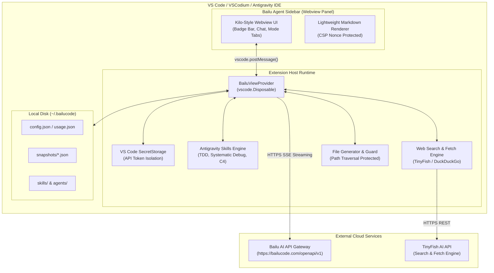

# Bailu Agent — Next-Generation AI Coding Sidebar


[](https://github.com/alsyundawy/bailu-kilo-agent/releases)
[](https://code.visualstudio.com/)
[](LICENSE)
[](https://trunk.io)
[](https://www.typescriptlang.org/)
[](https://bailucode.com)
[](https://github.com/alsyundawy/bailu-kilo-agent/releases)
[](https://www.paypal.me/alsyundawy)

> **Next-generation agentic pair-programmer and intelligent coding sidebar for BAILU AI cloud services with Kilo-style interface, 39 live models, and native Antigravity engineering methodology.**
>
> Designed, engineered, and maintained by **[`HARRY DERTIN SUTISNA ALSYUNDAWY (@alsyundawy)`](https://github.com/alsyundawy)** — Built for modern AI-assisted software engineering.
>
> 📦 **[`GitHub Releases`](https://github.com/alsyundawy/bailu-kilo-agent/releases)** &nbsp;|&nbsp; 🌐 **[`Bailu AI Cloud`](https://bailucode.com)** &nbsp;|&nbsp; 📜 **[`Full Changelog (CHANGELOG.md)`](CHANGELOG.md)** &nbsp;|&nbsp; 💖 **[`Support via PayPal`](https://www.paypal.me/alsyundawy)** &nbsp;|&nbsp; 🇮🇩 **[`QRIS Donation`](#-indonesian--regional-support-qris-quick-response-code-indonesian-standard)**

---

## 🧭 Navigation

- [Overview](#-overview)
- [Why This Modernized Edition?](#-why-this-modernized-edition)
- [Key Features](#-key-features)
- [Architecture & Design](#️-architecture--design)
- [Model Catalog (39 Models)](#-model-catalog-39-models)
- [Specialized Agent Modes](#-specialized-agent-modes)
- [Reasoning & Thinking Levels](#-reasoning--thinking-levels)
- [Deep Web Tools (TinyFish & Fallback)](#-deep-web-tools-tinyfish--fallback)
- [Installation & Setup](#-installation--setup)
- [Configuration Reference](#️-configuration-reference)
- [Local Persistence (`~/.bailucode`)](#-local-persistence-bailucode)
- [Quality Assurance & Verification Gates](#-quality-assurance--verification-gates)
- [Engineering Standards & Invariants](#-engineering-standards--invariants)
- [Security & Content Safety](#-security--content-safety)
- [Development & Build Workflow](#️-development--build-workflow)
- [Quick Start Guide](#-quick-start-guide)
- [Maintainer & Contact](#-maintainer--contact)
- [Support & Donation](#-support--donation)
- [License](#-license)

---

## 🌟 Overview

**Bailu Agent** is a lightweight, zero-runtime-dependency VS Code extension engineered for seamless integration with **BAILU AI** cloud services ([`https://bailucode.com`](https://bailucode.com)).

Inspired by the ergonomic, high-density Kilo sidebar panel, Bailu Agent equips software engineers, architects, and researchers with an autonomous agentic pair-programmer directly inside their editor.

---

## 🚀 Why This Modernized Edition?

This edition (**v1.1.9**) represents a complete architectural, security, accessibility, and visual overhaul of the extension:

### 🛡️ 1. Zero-Bloat Native TypeScript & CSP Isolation

- **Pure Vanilla TypeScript**: Built directly with native VS Code Webview and Extension Host APIs. Zero heavy UI frameworks, zero external runtime node modules.
- **Cryptographic CSP Nonces**: Every webview instance dynamically generates a unique `crypto.randomUUID()` cryptographic nonce, blocking unauthorized inline scripts and mitigating XSS risks.
- **Strict Path-Traversal Prevention**: Automated code writing inspects target paths with `path.relative()` to ensure files are only written inside the active workspace boundary.
- **OS Keychain Secret Storage**: API tokens and keys are isolated inside VS Code's encrypted `SecretStorage`—never committed to disk or `settings.json`.

### 🧠 2. Antigravity Superpowers Methodology

- **Embedded Engineering Rigor**: Built with built-in runbook triggers for Red-Green-Refactor Test-Driven Development (TDD), 4-Phase Systematic Debugging, 5-Dimension Code Review, and C4 Architecture Design.
- **Dynamic Context Injection**: Supports `@skill:<name>` syntax (e.g., `@skill:superpowers:test-driven-development`) to automatically discover and inject runbook procedures directly into the agent context.
- **Multi-File Workspace Context**: Automatically scans workspace file trees and contextual file snippets (capped at 16 KB) for zero-hallucination accuracy.

### ⚡ 3. 39 Synchronized Models & Fine-Grained Reasoning (CoT)

- **Live Cloud Synchronization**: Synchronized with the latest Bailu AI model directory, supporting context windows up to **1,048,576 tokens** (1M) and single-response completions up to **262,144 tokens**.
- **Flagship Claude Opus 5 Tier**: Featuring `bailu-turing`, `bailu-2.8`, `bailu-2.8-nvfp8`, and `bailu-2.8-lite` with fine-grained Chain-of-Thought controls across 7 levels (`instant`, `low`, `medium`, `high`, `max`, `auto`, `off`).
- **Dense Coding Specialists**: The Apex series (`bailu-apex-2.7`, `bailu-apex-openclaw`, `bailu-apex-2`) fine-tuned for tool execution and autonomous agent workflows.

### 🌐 4. High-Fidelity Web Intelligence (TinyFish & Fallback)

- **TinyFish AI API Integration**: Direct retrieval via `api.search.tinyfish.ai` and semantic DOM scraping via `api.fetch.tinyfish.ai`.
- **Zero-Configuration Fallback**: Built-in DuckDuckGo web search and HTML parser kicks in automatically when third-party keys are absent.
- **Smart URL Parsing**: Simply paste an HTTP/HTTPS URL into the chat to trigger headless web crawling and markdown extraction.

---

## ✨ Key Features

### 🤖 AI Model Ecosystem

- **39 Live Synchronized Models** — Full alignment with the Bailu AI cloud dashboard, all verified from the live production API.
- **Flagship Enterprise Tier**: `bailu-turing` (1M context, 131K output, Deep Reasoning + Vision), `bailu-2.8` (Claude Opus 5 Tier, flagship multimodal), `bailu-2.8-nvfp8` (NVFP8 high-speed quantized), `bailu-2.8-lite` (MoE efficient), `bailu-2.8-free` (218K output community access).
- **Apex Dense Coding Line**: `bailu-apex-2.7` (512K context, 262K output), `bailu-apex-openclaw` (tool-use & agent workflows), `bailu-apex-2` (1M context, deep codebase comprehension), `bailu-apex-2.6` (free multimodal), `bailu-apex-172b` (large-scale architecture).
- **Smart Auto Router**: `bailu-auto` automatically selects the optimal model engine based on prompt complexity and cost.
- **Ultra-Long Context**: Support for context windows up to **1,048,576 tokens** (1M) with single-response outputs up to **262,144 tokens** (256K).
- **Edge & Fast Line**: `bailu-dash`, `bailu-edge-2`, `bailu-edge-8b` (Agent MoE), `bailu-edge-0.5b`, `bailu-edge-thinking` for low-latency agentic tasks.
- **Frontier Series**: `Yuyu-Titan-3.0`, `Yuyu-Legend-Preview`, `yuyu-air` (MoE Free), `bailu-2.6`, and `bailu-im-30b-test`.

### 🧠 Deep Reasoning Engine

- **7 Chain-of-Thought Levels**: Fine-grained reasoning intensity control — `instant`, `low`, `medium`, `high`, `max`, `auto`, and `off`.
- **Adaptive Thinking Selector**: Reasoning controls automatically dim (`.no-think` styling) when the active model does not support thinking parameters.
- **Streaming SSE Support**: Real-time token-by-token streaming with TextDecoder final-flush fix — guarantees the last token is always delivered without truncation.
- **Fallback Resilience**: Full `reasoning_effort` parameter preserved in automatic non-streaming fallback on 503/network errors.

### 🎭 Specialized Agent Modes

Six built-in agent personalities, each with a distinct system prompt and behavior profile:

| Mode | Focus |
| :--- | :--- |
| **Code** | Write, refactor, and optimize production code |
| **Plan** | Phased implementation planning and task breakdown |
| **Ask** | Research, explanation, and QA with no file writes |
| **Debug** | 4-phase systematic debugging and root cause analysis |
| **Review** | 5-dimension code review (correctness, security, performance, readability, architecture) |
| **Arch** | C4 architecture design, ADR drafting, and system design |

### 🌐 High-Fidelity Web Intelligence

- **TinyFish AI API** (`api.search.tinyfish.ai` + `api.fetch.tinyfish.ai`) for semantic search and full-DOM markdown extraction.
- **Automatic URL Detection**: Paste any HTTP/HTTPS URL into the chat to trigger instant headless web crawl + markdown conversion.
- **Zero-Config Fallback**: Built-in DuckDuckGo HTML search parser activates automatically when no TinyFish key is configured.
- **Web Source Citations**: Search results are injected as context before the LLM response for transparent, grounded answers.

### 🎨 Modern Kilo-Style UI (v1.1.9 Overhaul)

- **Crisp SVG Codicons**: Developer-oriented inline SVG action icons consistent across Dark, Light, and High-Contrast themes — no system OS emoji dependency.
- **Welcome Card** (`#welcomeCard`): Four one-click prompt starters (`💡 Explain active file`, `✨ Refactor & clean`, `🧪 Generate unit tests`, `🔍 Debug & find bugs`) when chat is empty, auto-dismissed on first message.
- **Live Streaming Indicator**: Animated cursor `▍` with `@keyframes blinkCursor` during active SSE token reception.
- **Pulsing Status Dot** (`#statusDot`): Glowing green (idle) / pulsing amber-blue (busy) with dynamic tooltip.
- **High-Contrast Message Bubbles**: Clear visual separation between user (`👤 You`) and assistant (`🤖 Bailu`) messages. Readable at 250px narrow sidebar widths.
- **Dynamic Capability Badge Bar** (`#modelBadgeBar`): Real-time pills showing context length (`1M ctx`, `262K ctx`), max output (`131K out`, `262K out`), and tags (`Opus 5 Tier`, `Vision`, `Free`, `Edge`, `MoE`).
- **Code Block Language Headers**: Fenced code blocks feature language labels and isolated CSP-safe copy buttons with `✓` confirmation animation.
- **Adaptive Send / Stop Toggle**: Single button seamlessly switches between Send and Stop to save space on compact sidebars.
- **Auto-Expanding Input**: Chat textarea grows dynamically up to 200px when typing long prompts or pasting multi-line code blocks.
- **One-Click Export**: Copy any assistant message (`📋`), export full session as Markdown transcript (`📄`), or archive conversation state as a timestamped JSON snapshot (`📷`).

### 🔒 Security & Reliability

- **Encrypted Keychain Storage**: API tokens stored exclusively in VS Code `SecretStorage` — never written to `settings.json` or disk.
- **Cryptographic CSP Nonces**: Every webview renders with a unique `crypto.randomUUID()` nonce, blocking XSS and unauthorized script injection.
- **Strict Path-Traversal Guards**: AI-generated file writes verify target paths with `path.relative()` against the active workspace boundary.
- **Snapshot Path Hardening**: `path.basename()` wrapping in `loadSnapshot()` blocks directory traversal outside `~/.bailucode/snapshots/`.
- **Mandatory Restart Prompt**: Every install, update, or reinstall triggers an interactive notification to restart the Extension Host, ensuring zero stale state and fresh `SecretStorage` access.
- **Read-Only Environment Resilience**: Sandboxed `writeJson()` with `try/catch` — safe in Docker, Nix, and remote containers.

### ⚙️ Developer Experience

- **Antigravity Superpowers Methodology**: Built-in `@skill:<name>` syntax injects TDD, 4-phase debugging, 5-dimension review, and 350+ Antigravity skill runbooks directly into the agent context.
- **Workspace Auto-Context** (16 KB cap): Automatically enriches prompts with relevant workspace file snippets for reduced hallucinations.
- **Automated File Writing Mode Guard**: AI file generation is locked in `Ask` and `Plan` modes; common library filenames (e.g., `vue.js`) are excluded.
- **Bilingual Localization**: Full UI available in **English** (`en`) and **Bahasa Indonesia** (`id`) with automatic theme sync (`auto`, `dark`, `light`).
- **Global `~/.bailucode` Persistence**: Config, skills, agents, and usage data persist locally and sync with VS Code workspace settings.
- **Universal IDE Compatibility**: Runs on VS Code, Code-OSS, VSCodium, Cursor, Windsurf, Trae, Kilo Code, Antigravity-IDE, vscode.dev, GitHub Codespaces, and all `vscode` API-compatible forks.

---

## 🏗️ Architecture & Design

Bailu Agent bridges your local workspace and the remote Bailu AI cloud via an asynchronous, event-driven architecture:



---

## 📊 Model Catalog (39 Models)

Bailu Agent ships with a synchronized, production-tested catalog of 39 models categorized into specialized tiers:

### 1. Enterprise Deep Reasoning Flagship & Bailu 2.8 Generation

| Model ID            | Context Limit      | Max Output  | Thinking Levels | Capabilities & Tags                                   |
| :------------------ | :----------------- | :---------- | :-------------- | :---------------------------------------------------- |
| `bailu-turing`      | **1,048,576 (1M)** | **131,072** | Low – Max       | Enterprise Deep Reasoning Flagship, Multimodal Vision |
| `bailu-2.8`         | **1,048,576 (1M)** | **131,072** | Instant – Max   | Flagship, Multimodal Vision, Code Generation          |
| `bailu-2.8-nvfp8`   | **1,048,576 (1M)** | 128,000     | Low – High      | NVFP8 Quantized, High-Speed Inference                 |
| `bailu-2.8-lite`    | 262,144 (262K)     | 65,536      | Low – Max       | MoE Architecture, Efficient Reasoning                 |
| `bailu-2.8-free`    | 262,144 (262K)     | **218,000** | Instant – Max   | Free Tier Community Access, Deep Output               |
| `bailu-2.8-preview` | 1,048,572 (1M)     | 131,072     | —               | Frontier Preview Builds                               |
| `bailu-2.8-vl-2B`   | 256,000 (256K)     | 65,536      | —               | Lightweight Vision & Agent Automation                 |

### 2. Bailu 2.7 High-Performance Series

| Model ID            | Context Limit      | Max Output  | Capabilities & Highlights               |
| :------------------ | :----------------- | :---------- | :-------------------------------------- |
| `bailu-2.7`         | 262,140            | 128,000     | Flagship 2.7, Balanced Reasoning & Code |
| `bailu-2.7-1m`      | **1,024,570 (1M)** | 128,000     | Ultra-Long Context Analysis             |
| `bailu-2.7-free`    | 262,144            | **262,144** | NVFP4 Free Tier, Symmetrical In/Out     |
| `bailu-2.7-fast`    | 256,000            | 128,000     | Low Latency, High Concurrency           |
| `bailu-2.7-lite`    | 131,072            | 50,000      | Diffusion & Rapid Parsing               |
| `bailu-2.7-lite-vl` | 262,144            | 128,000     | Multimodal Vision Assistant             |
| `bailu-2.7-vl-350m` | 32,768             | 32,000      | Ultra-Compact Edge Vision               |

### 3. Apex Line (Dense Coding & Agent Specialists)

| Model ID              | Context Limit      | Max Output  | Specialization                               |
| :-------------------- | :----------------- | :---------- | :------------------------------------------- |
| `bailu-apex-2.7`      | **512,000 (512K)** | **262,144** | Multimodal Heavyweight, Instant–Max Thinking |
| `bailu-apex-openclaw` | 256,000 (256K)     | 128,000     | Fine-tuned for Tool-Use & Agent Workflows    |
| `bailu-apex-2`        | **1,048,000 (1M)** | 256,000     | Dense Codebase Comprehension                 |
| `bailu-apex-2.6`      | 512,000 (512K)     | 256,000     | Free Multimodal Analysis                     |
| `bailu-apex-172b`     | 200,000            | 196,000     | Large-Scale Architectural Synthesis          |
| `bailu-apex-120b`     | 252,000            | 128,000     | Long-Attention Code Navigation               |
| `bailu-apex-30B`      | 256,000            | 128,000     | SynFlow Free Coding Tier                     |
| `bailu-apex-25b`      | 200,000            | 62,400      | High-Density Coding Precision                |
| `bailu-apex-2.5`      | 131,072            | 131,072     | Vision & Diagram Parsing                     |
| `bailu-apex-2.1-lite` | **1,000,000 (1M)** | 65,500      | Fast Agent Automation                        |
| `bailu-apex-1b`       | 32,768             | 32,000      | Micro Chain-of-Thought (CoT)                 |

### 4. Fast, Edge & Frontier Series

- **Smart Auto Router**: `bailu-auto` (256K context / 128K out) — Automatically selects the optimal engine based on prompt complexity.
- **Fast / Edge Line**: `bailu-dash-free`, `bailu-dash`, `bailu-edge-2`, `bailu-edge-8b` (Agent MoE), `bailu-edge-0.5b`, `bailu-edge-thinking`.
- **Frontier Models**: `Yuyu-Titan-3.0`, `Yuyu-Legend-Preview`, `yuyu-air` (MoE Free), `bailu-2.6`, `bailu-im-30b-test`.

---

## 🎯 Specialized Agent Modes

Switch between modes using the top-level tab grid or shortcut commands:

```text
┌─────────┬─────────┬─────────┬─────────┬──────────┬─────────┐
│  Code   │  Plan   │   Ask   │  Debug  │  Review  │  Arch   │
└─────────┴─────────┴─────────┴─────────┴──────────┴─────────┘
```

1. **💻 Code**: Implementation specialist. Enforces strict typing, clean patterns, defensive programming, and zero hallucinations. In Code mode, multi-file code blocks automatically display a **Save to File** button.
2. **📋 Plan**: Spec-driven architecture planner. Generates bite-sized task checklists, acceptance criteria, and dependency trees without writing speculative code.
3. **💬 Ask**: Read-only codebase consultant. Answers technical questions and explains algorithms with cited references.
4. **🐞 Debug**: 4-Phase Systematic Debugging:
   - _Phase 1_: Reproduce & isolate defect with minimal tests.
   - _Phase 2_: Trace execution flow and state anomalies to root causes.
   - _Phase 3_: Formulate a minimal hypothesis.
   - _Phase 4_: Implement minimal fix and verify against regression.
5. **🔍 Review**: 5-Dimension Code Review: evaluates changes across **Correctness**, **Readability**, **Architecture**, **Security**, and **Performance**.
6. **🏛️ Arch**: System Architect. Designs software boundaries using **Clean Architecture**, **Hexagonal Architecture**, **Domain-Driven Design (DDD)**, and outputs **C4 diagrams** and **ADRs**.

> 💡 **Pro Tip**: Use `@skill:<name>` in your chat prompt (e.g., `@skill:superpowers:test-driven-development`) to dynamically inject specialized runbooks into the context!

---

## 🧠 Reasoning & Thinking Levels

For models supporting deep Chain-of-Thought reasoning (such as `bailu-2.8`, `bailu-apex-2.7`, and `bailu-2.8-lite`), you can select your desired reasoning intensity:

- **`instant`**: Ultra-fast response with minimal CoT overhead.
- **`low`**: Light reasoning for routine syntax checks and straightforward functions.
- **`medium`**: Balanced reasoning for standard feature implementations.
- **`high`** _(Default)_: Thorough multi-step verification for complex tasks.
- **`max`**: Deepest theoretical analysis for architectural proofs, concurrency, and security audits.
- **`auto`**: Let the Bailu engine dynamically determine the reasoning budget.
- **`off`**: Completely disable reasoning tokens for raw completion speed.

---

## 🌐 Deep Web Tools (TinyFish & Fallback)

Bailu Agent features native web retrieval capabilities accessible via the **🌐 Web** button or automatic tool calling:

1. **TinyFish AI API Integration**:
   - `api.search.tinyfish.ai`: Returns dense, structured web intelligence curated specifically for LLM context windows.
   - `api.fetch.tinyfish.ai`: Headless browser rendering that converts raw JavaScript-heavy pages into clean, semantic Markdown.
2. **DuckDuckGo Direct Fallback**:
   - When no TinyFish API key is provided, the extension falls back to zero-configuration DuckDuckGo web search and safe HTML parsing.
3. **Smart URL Triggers**:
   - Pasting any HTTP/HTTPS URL into the prompt or prepending with `scrape:<url>` triggers automatic page crawling and context extraction.

---

## 📦 Installation & Setup

### Option 1: Install from VSIX Package (Recommended)

1. Download the latest `bailu-kilo-agent-1.1.9.vsix` release from [GitHub Releases](https://github.com/alsyundawy/bailu-kilo-agent/releases).
2. In VS Code / VSCodium / Antigravity, open the Command Palette (`Cmd+Shift+P` or `Ctrl+Shift+P`).
3. Select **Extensions: Install from VSIX...** and choose the downloaded file.
4. Or install directly via terminal:

   ```bash
   code --install-extension bailu-kilo-agent-1.1.9.vsix
   ```

> [!IMPORTANT]
> **Mandatory Restart**: Every fresh install, update, upgrade, download, or re-installation requires an Extension Host restart (`workbench.action.restartExtensionHost`) or Window reload (`workbench.action.reloadWindow`). Bailu Agent automatically presents an interactive prompt upon activation to execute this action.

### Option 2: Build from Source

```bash
# 1. Clone repository
git clone https://github.com/alsyundawy/bailu-kilo-agent.git
cd bailu-kilo-agent

# 2. Install development dependencies
npm install

# 3. Compile TypeScript
npm run compile

# 4. Run automated test suite
npm test

# 5. Build production VSIX package
npm run package
```

### Initial Configuration

1. Click the **Bailu Agent** icon in the Activity Bar.
2. Click the **⚙ (Settings)** button on the top right of the panel.
3. Configure your credentials:
   - **API Token**: Paste your token from [Bailu Cloud Dashboard](https://bailucode.com). _(Stored securely in VS Code SecretStorage)_.
   - **Base URL**: Default is `https://bailucode.com/openapi/v1`.
   - **TinyFish API Key** _(Optional)_: Key for enhanced web crawling.
4. Click **Save & Test Connection**. When you see `✔ Connection OK`, you are ready!

---

## ⚙️ Configuration Reference

Customize settings in your VS Code `settings.json`:

| Setting Key            | Type     | Default                              | Description                                                                 |
| :--------------------- | :------- | :----------------------------------- | :-------------------------------------------------------------------------- |
| `bailu.baseUrl`        | `string` | `"https://bailucode.com/openapi/v1"` | OpenAI-compatible endpoint URL for Bailu AI.                                |
| `bailu.model`          | `string` | `"bailu-auto"`                       | Default model ID for chat and completions.                                  |
| `bailu.thinking`       | `enum`   | `"high"`                             | Reasoning level (`auto`, `instant`, `low`, `medium`, `high`, `max`, `off`). |
| `bailu.mode`           | `string` | `"code"`                             | Active mode (`code`, `plan`, `ask`, `debug`, `review`, `arch`).             |
| `bailu.locale`         | `enum`   | `"en"`                               | UI language (`en` for English, `id` for Bahasa Indonesia).                  |
| `bailu.theme`          | `enum`   | `"auto"`                             | Sidebar theme (`auto`, `dark`, `light`).                                    |
| `bailu.bookmarks`      | `array`  | `["bailu-auto"]`                     | Quick-access bookmarked model IDs.                                          |
| `bailu.maxTokens`      | `number` | `0`                                  | Max tokens per response (0 = use model's maximum limit).                    |
| `bailu.tinyfishApiKey` | `string` | `""`                                 | Optional TinyFish API Key for real-time web crawling.                       |

---

## 📁 Local Persistence (`~/.bailucode`)

To ensure custom settings survive extension updates, Bailu Agent maintains a persistent workspace directory at `~/.bailucode/`:

```text
~/.bailucode/
├── config.json       # Synced settings, bookmarks, and parameters
├── usage.json        # Lifetime token consumption and prompt metrics
├── skills/           # Custom user-defined Antigravity skill runbooks
│   └── <skill>/SKILL.md
├── agents/           # Custom agent definitions (<agent>.md)
└── snapshots/        # Archived conversation state captures (.json)
```

---

## 📊 Quality Assurance & Verification Gates

Every release of Bailu Agent undergoes comprehensive automated quality gates to ensure production stability, security, and high performance:

| Quality Gate               | Verification Tool / Pipeline                | Target Scope                                                      | Status                          |
| :------------------------- | :------------------------------------------ | :---------------------------------------------------------------- | :------------------------------ |
| **Comprehensive Linting**  | [`Trunk Check`](https://trunk.io)           | 9 Linters (`prettier`, `markdownlint`, `trufflehog`, etc.)        | **PASSED (24/24 files clean)**  |
| **Strict Type Checking**   | [`TypeScript Compiler`](https://tsc.io)     | `tsc -p ./` with strict typing and ES2022 target                  | **PASSED (0 errors)**           |
| **Manifest & Asset Verif** | `node test/verify.js`                       | Package manifest, SVG codicons, and bundle integrity              | **PASSED (100% verified)**      |
| **Extension Host Sandbox** | `node test/test-install.js`                 | VSIX simulation, lifecycle activation, 5 commands, zero ts-leak   | **PASSED (100% clean sandbox)** |
| **Production Packaging**   | [`vsce package`](https://github.com/vscode) | Optimized `.vsix` bundle packaging with zero runtime dependencies | **PASSED (90.38 KB bundle)**    |

---

## 📋 Engineering Standards & Invariants

Bailu Agent adheres to strict engineering invariants to guarantee security, performance, and reliability:

- **Zero Runtime Dependencies**: The production `.vsix` bundle MUST NOT ship any external third-party `node_modules`. All runtime operations rely exclusively on native VS Code APIs and standard Node.js libraries.
- **Secure Token Storage**: Sensitive credentials (Bailu API tokens, TinyFish keys) MUST be stored in VS Code `SecretStorage` (OS Keychain). They MUST NEVER be written in plain text to workspace settings or disk files.
- **Workspace Boundary Invariant**: The automated code generator MUST verify destination file paths against the active workspace boundary using `path.relative()` before creating or modifying files.
- **Non-Destructive Execution**: File generation MUST NOT run during `Ask` or `Plan` modes. Code generation MUST require user review and explicit interaction.
- **CSP Nonce Isolation**: All Webview script tags and styles MUST be protected by dynamically generated cryptographic nonces.

---

## 🔒 Security & Content Safety

- **Zero Plaintext Secrets**: Sensitive API keys and tokens are stored using VS Code's native `SecretStorage` API (OS Keychain / Credential Vault) and are never committed to `settings.json`.
- **Content Security Policy (CSP)**: Every webview instance generates a unique cryptographic nonce (`crypto.randomUUID()`), completely blocking cross-site scripting (XSS) and unauthorized script execution.
- **Path Traversal Guards**: Automated file generation inspects target file paths against directory traversal patterns (`..`, leading slashes, and illegal root jumps) to ensure files can only be written within the workspace.
- **Snapshot Path Sanitization**: File restoration wraps IDs with `path.basename()` to eliminate relative path traversal.

---

## 🛠️ Development & Build Workflow

Bailu Agent includes comprehensive automated verification and packaging suites:

```bash
# 1. Compile TypeScript to out/
npm run compile

# 2. Watch mode during local development
npm run watch

# 3. Run complete verification test suite
npm test

# 4. Package distribution VSIX
npm run package
```

### Test Suite Details

- **`test/verify.js`**: Validates manifest integrity, contributes structure, SVG codicons, and build artifacts.
- **`test/test-install.js`**:
  - Simulates end-user package extraction from `.vsix`.
  - Verifies zero leakage of source `.ts` files, test directories, or development artifacts.
  - Launches an Extension Host sandbox to confirm activation, provider lifecycle, and registration of all 5 commands.

---

## 🚀 Quick Start Guide

**Bailu Agent** is an agentic AI coding sidebar extension for VS Code, VSCodium, Cursor, Windsurf, Trae, and Antigravity connected directly to the **BAILU AI** cloud platform ([`https://bailucode.com`](https://bailucode.com)).

### Core Capabilities

- **39-Model Synchronized Catalog**: Instant access to enterprise flagship `bailu-turing` (1M context, 131K output, deep reasoning), `bailu-2.8` (Opus 5 tier), `bailu-2.8-free`, Apex series for intensive programming, and lightweight edge models.
- **6 Intelligent Agent Modes**: Switch between `Code`, `Plan`, `Ask`, `Debug`, `Review`, and `Arch` depending on your current workflow stage.
- **Deep Reasoning (Thinking Levels)**: Control Chain-of-Thought reasoning intensity from `instant` to `max`.
- **TinyFish Web Intelligence**: Fetch up-to-date documentation and scrape web content directly into your AI prompt.
- **Enterprise Security**: API tokens are securely isolated in the OS `SecretStorage` with zero vulnerable third-party dependencies.

### Quick Setup

1. Install the `.vsix` package via `Extensions: Install from VSIX...` in VS Code or your IDE.
2. Click the Bailu Agent icon in the Activity Bar on the left.
3. Click the **Settings (gear icon)** button, enter your Bailu API token, and click **Save & test connection**.
4. Select your preferred model (e.g., `bailu-auto`, `bailu-turing`, or `bailu-2.8`) and start coding!

---

## 📬 Maintainer & Contact

For technical questions, feature requests, or collaboration:

- **Lead Maintainer & Engineering**: **HARRY DERTIN SUTISNA ALSYUNDAWY** — [`ALSYUNDAWY IT SOLUTION`](https://alsyundawy.com)
- **Official Website**: [`https://alsyundawy.com`](https://alsyundawy.com)
- **GitHub Profile**: [`@alsyundawy`](https://github.com/alsyundawy)
- **Email**: [`alsyundawy@gmail.com`](mailto:alsyundawy@gmail.com)
- **Phone / WhatsApp / Telegram**: [`+62 856-8515-212`](tel:+628568515212)
- **Repository**: [`https://github.com/alsyundawy/bailu-kilo-agent`](https://github.com/alsyundawy/bailu-kilo-agent)

---

## 💖 Support & Donation

If **Bailu Agent** has improved your coding productivity, consider supporting its continuous maintenance, security audits, and open-source development:

### 💳 International Support: PayPal

[](https://www.paypal.me/alsyundawy)

- **PayPal Link**: [`https://www.paypal.me/alsyundawy`](https://www.paypal.me/alsyundawy)

### 🇮🇩 Indonesian & Regional Support: QRIS (Quick Response Code Indonesian Standard)

Scan the QRIS barcode below using any Indonesian mobile banking app (BCA, Mandiri, BRI, BNI, BSI, CIMB Niaga, Permata) or e-wallet (GoPay, OVO, DANA, LinkAja, ShopeePay):


- **Merchant / Account Name**: **ALSYUNDAWY IT SOLUTION**
- **NMID**: **`ID1020021153676`**
- **Direct Barcode Asset Link**: [`https://github.com/user-attachments/assets/a0126f28-6dde-43da-ba14-d7c9a27de0df`](https://github.com/user-attachments/assets/a0126f28-6dde-43da-ba14-d7c9a27de0df)
- **WhatsApp Confirmation**: [`+62 856-8515-212`](https://wa.me/628568515212)

Your support directly powers open-source tooling, security enhancements, and agentic AI developer experiences.

---

## 📄 License

Bailu Agent is licensed under the [`MIT License`](LICENSE) © 2023–2026 Harry DS Alsyundawy.
Feel free to use, modify, and distribute it for personal and enterprise engineering workflows.
